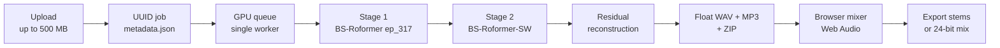

<div align="center">

# 🎛️ StemFlow

**Local-GPU stem separation and mixing studio.**

Drop in a track, get six sample-aligned stems, mix them in the browser, and export lossless.

[](https://nextjs.org)
[](https://react.dev)
[](https://fastapi.tiangolo.com)
[](https://python.org)
[](https://typescriptlang.org)
[](#separation-pipeline)
[](#hardware)

**English** · [한국어](#korean)

</div>

---

## Overview

StemFlow uploads an audio file into an isolated UUID job, runs a two-stage
BS-Roformer v4 cascade on a local CUDA GPU, and exposes six sample-aligned stems
in a Web Audio mixer. From there you can solo, mute, balance, and export — either
the lossless stems or a freshly rendered 24-bit mix.



## Features

| | |
|---|---|
| 🎚️ **Six stems** | `vocals` · `drums` · `bass` · `guitar` · `piano` · `other` — all sample-aligned |
| ⚡ **Local GPU** | Single-GPU background queue with restart recovery and cancellation |
| 🔊 **Browser mixer** | Sample-synchronized Web Audio transport: seek, mute, solo, master volume, data-derived waveforms |
| 💾 **Lossless out** | Float WAV masters, MP3 previews for the browser, ZIP packaging, server-side 24-bit mix rendering |
| 📦 **Isolated jobs** | Persistent UUID directories with atomic `metadata.json` writes |
| 📈 **Live status** | Status polling, staged progress, explicit errors, deletion, 24-hour cleanup |
| 🌐 **Demo mode** | Optional offline walkthrough of the mixer — see [Demo audio](#demo-audio) |
| 🎧 **Formats** | `.mp3` `.wav` `.flac` `.m4a` `.aac` `.ogg`, streamed upload with format validation |

## Separation pipeline

Two BS-Roformer models run in cascade, and the sixth stem is *computed* rather
than inferred. The whole pipeline lives in [`worker/separate_v4.py`](worker/separate_v4.py);
model inference itself is delegated to the CUDA `audio-separator` executable, so
the API process only ever needs NumPy and SoundFile.

### Stages

| # | Step | Input → Output | Progress |
|---|---|---|---|
| 0 | **Validate** | `sf.info` on the source; rejects empty files and anything that isn't mono or stereo | 8% |
| 1 | **Vocal split** — `model_bs_roformer_ep_317_sdr_12.9755.ckpt` | `source` → `vocals` + `instrumental` | 12% |
| 2 | **Instrument split** — `BS-Roformer-SW.ckpt` | `instrumental` → `drums`, `bass`, `guitar`, `piano` | 46% |
| 3 | **Align + residual** | five stems + source → six float64 arrays on a common grid | 82% |
| 4 | **Write masters** | float32 WAV at the source sample rate | 88% |
| 5 | **Previews** | 192 kbps `libmp3lame` MP3 per stem | 92% |
| 6 | **Package** | `exports/stems.zip` | 97% |

Stage 2 reads stage 1's **instrumental**, not the original — so vocal bleed is
already removed before the instrument model ever sees the audio.

### Sample-accurate alignment

Two model passes over two different files return outputs whose lengths don't
necessarily agree. Rather than resampling or padding, the pipeline finds the
largest grid all six signals genuinely share and refuses anything that doesn't fit:

```python
length = min(len(mix), *(sf.info(path).frames for path in paths.values()))
```

Every stem is then read at `float64` and validated before use — a sample-rate
mismatch, a channel-count mismatch, or an unexpectedly short output raises
instead of being silently patched up. Nothing is stretched, resampled, or
zero-filled, which is what makes the stems line up sample-for-sample in the
browser mixer.

### The residual invariant

`other` is never predicted by a model. The instrument model emits its own
leftover stem, and StemFlow **discards it** — recomputing the remainder against
the true mix instead:

$$\text{other} = \text{mix} - (\text{vocals} + \text{drums} + \text{bass} + \text{guitar} + \text{piano})$$

Computed in `float64`, this makes the invariant exact:

> **The six stems sum back to the aligned original.**

That is a stronger guarantee than a model's own residual output, which only sums
back to whatever *it* was fed. The trade-off is honest and worth knowing: because
`other` is a true difference, it absorbs everything the five stems didn't claim —
unmodeled instruments (strings, synths, FX), separation leakage, **and** the
reconstruction error of both model stages. It's the remainder, not a clean
"everything else" stem.

Masters are written as `float32` WAV with no normalization pass, so headroom and
inter-stem levels survive untouched — the residual stays valid after the round trip.

### Silent stems

`audio-separator` does not write a stem whose peak falls below `1e-6` — it logs
it as saved and lists it in the final output summary, but the file never appears.
A track with no piano part is ordinary input, so a missing file is read as
**"this stem is silent"**, not as a failure: the stem is filled with zeros,
written like any other, and named in `separation.silentStems`.

This matters because a silent stem contributes exactly zero to the sum, so the
residual invariant holds unchanged. If the vocal pass leaves no instrumental at
all — an a-cappella source — the second model pass is skipped entirely and all
four instrument stems are zero-filled.

### Inference settings

| Flag | Value | Configurable | Why |
|---|---|---|---|
| `--sample_rate` | source rate | — | Never resample; the residual requires a shared grid |
| `--normalization` | `1.0` | pinned | Rescaling would invalidate the residual invariant |
| `--mdxc_overlap` | `8` | `STEMFLOW_MDXC_OVERLAP` | Higher chunk overlap — better seam quality, slower inference |
| `--use_autocast` | on | `STEMFLOW_USE_AUTOCAST` | Mixed-precision CUDA inference; turn off for bit-reproducible runs |
| `--output_format` | `WAV` | — | Lossless hand-off between stages |

Both knobs are read **once per job**, so changing the environment mid-run can't
make the two model passes disagree. The values used are recorded under
`separation` in `metadata.json`, which is what keeps two runs of the same track
comparable:

```json
"separation": {
  "vocalModel": "model_bs_roformer_ep_317_sdr_12.9755.ckpt",
  "instrumentModel": "BS-Roformer-SW.ckpt",
  "mdxcOverlap": 8,
  "autocast": true,
  "reconstructionError": 1.19e-07,
  "silentStems": ["piano"]
}
```

`reconstructionError` is the peak of `|sum(stems) - source|` measured on the
float32 data as written to disk, so the invariant is checked against the real
output rather than only in memory. Expect ~`1e-7` from the float32 cast; a
materially larger number means something upstream broke the invariant.

### Mix rendering

Server-side export ([`server/mix.py`](server/mix.py)) applies each fader in
`float64`, sums, and writes 24-bit PCM. Levels are validated to `0 ≤ v ≤ 1.5`,
and peak normalization only engages if the sum actually exceeds full scale — so
a mix that fits is bit-faithful to the stems:

```python
if peak > 1:
    mixed /= peak
```

### Cancellation and recovery

Cancellation is cooperative and checked at every meaningful boundary: between
stages, inside the separator's output-reading loop (`terminate` → 10 s grace →
`kill`), and before each stem write and preview encode. Stage directories
`_stage1` / `_stage2` are removed in a `finally` block, so a cancelled or failed
job leaves no partial scratch data. Progress and stage strings are written to
`metadata.json` atomically via a temp-file `replace`, which is what lets the
queue recover its state across a restart.

## Prerequisites

> [!IMPORTANT]
> **StemFlow does not ship the separation engine or the model weights.** You
> install those yourself, then tell StemFlow where they are. Without them the
> studio still runs, but only in demo mode — `/api/health` reports
> `modelsReady: false` and uploads are refused rather than accepted and failed.

### Hardware

**An NVIDIA GPU with CUDA is required.** `preflight.ps1` asserts
`torch.cuda.is_available()` and stops if it fails — there is no CPU path in this
project's setup flow, and CPU inference on these models would be impractically
slow for interactive use.

Measured on the reference machine:

| | |
|---|---|
| GPU | NVIDIA RTX 5060 Ti, 15.9 GB VRAM, compute capability `sm_120` |
| Stack | PyTorch 2.11.0+cu128, CUDA 12.8, cuDNN 9.19 |
| Peak VRAM during separation | **5.8 GB total, ~2.7 GB attributable** (3.0 GB was already in use at idle) |
| Speed (12-second stereo 44.1 kHz clip) | ~2 s inference **per stage** (~4 s total), plus 1–2 s to load each checkpoint; **~21 s end to end** through the API |

Both checkpoints are loaded per job, so roughly **4 GB of free VRAM is a sensible
floor and 6–8 GB is comfortable.**

Only about 4 of those 21 seconds are inference. The rest is fixed per-job
overhead — two separate `audio-separator` processes each importing PyTorch and
loading a ~700 MB checkpoint, then six MP3 encodes and the ZIP. Inference scales
with track length; the overhead does not, so it dominates on short clips and
matters much less on full songs. It is also why batching many tracks is slower
than the GPU time alone suggests.

> [!WARNING]
> **Match the PyTorch build to your GPU.** A default `pip install torch` can
> install a CUDA build that does not cover your architecture, producing an
> environment that imports fine but cannot use the GPU. This machine's `sm_120`
> (Blackwell) needs CUDA 12.8 or newer. Check with:
> ```
> python -c "import torch; print(torch.cuda.is_available(), torch.cuda.get_arch_list())"
> ```

### Software

You need three things, none of which are in this repository:

| # | What | Size | How |
|---|---|---|---|
| 1 | A CUDA **`audio-separator`** environment (PyTorch + CUDA) | ~4.8 GB | `pip install "audio-separator[gpu]"` in its own venv, with a PyTorch build matching your GPU |
| 2 | **FFmpeg** | ~200 MB | Any recent build |
| 3 | The two **BS-Roformer checkpoints** plus their `.yaml` configs | ~1.34 GB | See [Models](#models) |

Expect roughly **6.5 GB of disk** and a one-time download of comparable size.
On a new machine this is real setup work, not a `pip install` away — the CUDA
environment is the part that takes the longest to get right.

Then point StemFlow at them by copying `.env.example` to `.env` and filling in
the paths:

```powershell
Copy-Item .env.example .env
```

```ini
STEMFLOW_SEPARATOR_EXE=C:\path\to\.sepenv\Scripts\audio-separator.exe
STEMFLOW_FFMPEG_EXE=C:\path\to\ffmpeg\bin\ffmpeg.exe
STEMFLOW_MODEL_DIR=C:\path\to\audio-separator-models
```

Leaving a line out is fine when the asset sits somewhere StemFlow already looks —
see [Asset resolution](#asset-resolution). Verify with:

```powershell
.\scripts\preflight.ps1
```

It prints the resolved path **and which tier it came from** for every component,
then confirms CUDA is available. Nothing else runs until it passes.

## Quick start

**Requirements**

- Windows, an **NVIDIA GPU with CUDA**, and a CUDA `audio-separator` environment
  (see [Prerequisites](#prerequisites))
- The v4 model assets under `C:\tmp\audio-separator-models` — both checkpoints,
  both `.yaml` configs, and `download_checks.json` (see [Models](#models) for how
  to fetch them; they are not in this repository)
- Node 22.13+ and Python 3.12

**Setup** — begins with a CUDA / model / FFmpeg preflight and stops with an explicit
missing component if the workstation isn't ready:

```powershell
.\scripts\setup-local.ps1
```

**Run** — API and web app in separate terminals:

```powershell
.\scripts\start-api.ps1    # http://127.0.0.1:8000
.\scripts\start-web.ps1    # http://localhost:3000
```

Health lives at [`/api/health`](http://127.0.0.1:8000/api/health), interactive docs at
[`/docs`](http://127.0.0.1:8000/docs).

**Production web build:**

```powershell
.\scripts\build-web.ps1
```

## Batch runs

For experiment runs, [`scripts/batch.py`](scripts/batch.py) drives `separate_job()`
directly and skips the HTTP API entirely. Output lands in the normal storage root,
so batched tracks still show up in the studio UI:

```powershell
.\.venv\Scripts\python.exe scripts\batch.py tracks\
.\.venv\Scripts\python.exe scripts\batch.py tracks\ --overlap 16 --tag overlap16
.\.venv\Scripts\python.exe scripts\batch.py a.wav b.flac --no-autocast --keep-going
```

| Option | Effect |
|---|---|
| `--overlap N` | Override `--mdxc_overlap` for this run |
| `--no-autocast` | Disable mixed precision, for reproducible output |
| `--tag NAME` | Store a label on each job so runs are tellable apart |
| `--storage DIR` | Write to a separate storage root |
| `--keep-going` | Continue past a failed track instead of stopping |

Directories are expanded one level and filtered to supported formats. Batch jobs
are always created with retention disabled, so a run can't be reaped mid-comparison.
Each track prints its job ID and reconstruction error on completion, and the full
original path is kept in `sourcePath`.

## API

| Method | Endpoint | Description |
|---|---|---|
| `GET` | `/api/health` | Separator, encoder, and local model readiness |
| `GET` | `/api/jobs?limit=20` | Recent jobs |
| `POST` | `/api/jobs` | Upload audio, returns `202` with a job ID |
| `GET` | `/api/jobs/{id}` | Status, staged progress, stem URLs |
| `GET` | `/api/jobs/{id}/preview/{stem}` | MP3 preview for the browser |
| `GET` | `/api/jobs/{id}/stem/{stem}` | Lossless float WAV |
| `GET` | `/api/jobs/{id}/archive` | All stems as a ZIP |
| `POST` | `/api/jobs/{id}/mix` | Render the current mix from `{ levels }` |
| `DELETE` | `/api/jobs/{id}` | Delete a job (rejects while processing) |

## Configuration

Copy `.env.example` and adjust:

| Variable | Default | Purpose |
|---|---|---|
| `NEXT_PUBLIC_STEMFLOW_API_BASE` | `http://127.0.0.1:8000` | API base the web app talks to |
| `STEMFLOW_STORAGE_ROOT` | `./storage` | Job storage root |
| `STEMFLOW_MAX_UPLOAD_BYTES` | `524288000` | Upload cap (500 MB) |
| `STEMFLOW_RETENTION_HOURS` | `24` | Hours before a job is deleted; **`0` keeps jobs forever** |
| `STEMFLOW_WORKER_COUNT` | `1` | Concurrent GPU workers |
| `STEMFLOW_MDXC_OVERLAP` | `8` | Separator chunk overlap |
| `STEMFLOW_USE_AUTOCAST` | `true` | Mixed-precision inference |
| `STEMFLOW_ALLOWED_ORIGINS` | localhost origins | CORS allowlist |
| `STEMFLOW_MODEL_DIR` | `C:\tmp\audio-separator-models` | Absolute model directory |
| `STEMFLOW_OFFLINE` | `true` | Block outbound requests from the separator |
| `STEMFLOW_SEPARATOR_EXE` | v4 env path | `audio-separator` executable |
| `STEMFLOW_FFMPEG_EXE` | v4 env path | FFmpeg executable |

For an internet-facing deployment, run the API and CUDA worker on a GPU host and
build the web app with `NEXT_PUBLIC_STEMFLOW_API_BASE` pointed at its HTTPS URL.
The hosted build without a GPU still works as a demo.

> **Experimenting?** Set `STEMFLOW_RETENTION_HOURS=0`. Retention defaults to 24
> hours, which will delete work you left running overnight. Setting `0` also
> protects jobs created earlier while retention was enabled — cleanup becomes a
> no-op rather than only skipping new jobs.

## Offline operation

**Separation runs with no network access.** Inference is local, FFmpeg is local,
the API binds to loopback, and the web app pulls no CDN fonts, scripts, or
assets. Three things could otherwise have triggered a silent download, and each
is closed:

| Risk | Why it existed | How it's closed |
|---|---|---|
| **Wrong model directory** | `audio-separator` defaults to `/tmp/audio-separator-models/`, which on Windows resolves against *whichever drive you're on* — starting the API from `D:\` would look in `D:\tmp\…`, find nothing, and try to fetch | `--model_file_dir` is always passed as an absolute path from `STEMFLOW_MODEL_DIR` |
| **Missing `.yaml` configs** | Without a model's YAML, `load_model()` falls back to a hash lookup that downloads UVR model data | Both configs are required assets, checked before separation starts |
| **Missing `download_checks.json`** | Fetched from GitHub when absent, *even though the checkpoints are already present* | Treated as a required asset like the models themselves |

Assets are verified before stage 1, so a missing file fails in milliseconds with
an explicit local error instead of stalling on the separator's 300-second
download timeout:

```text
Missing 1 model asset(s) in C:\tmp\audio-separator-models: BS-Roformer-SW.yaml.
Separation needs these locally; set STEMFLOW_MODEL_DIR if they live elsewhere.
```

As a second layer, `STEMFLOW_OFFLINE=true` (the default) points the separator
subprocess at a dead loopback port, so if a future version tries to fetch
something anyway it fails immediately rather than hanging. Set it to `false`
only when you actually intend to download a model.

`GET /api/health` reports the whole picture — `modelsReady`, `modelDir`,
`missingModelFiles`, and `offline` — and the studio shows demo mode instead of
accepting an upload that could not succeed.

**What does need the network:** `setup-local.ps1` (pip and npm installs, one
time) and the hosted demo site. Neither is involved in local separation.

### Required local assets

```text
C:\tmp\audio-separator-models\
├── model_bs_roformer_ep_317_sdr_12.9755.ckpt   # 639 MB
├── model_bs_roformer_ep_317_sdr_12.9755.yaml   # inference params
├── BS-Roformer-SW.ckpt                         # 699 MB
├── BS-Roformer-SW.yaml                         # inference params
└── download_checks.json                        # model index
```

Verify at any time with:

```powershell
.\scripts\preflight.ps1
```

## Models

Neither model is bundled with this repository — they total about 1.34 GB. Both
are BS-Roformer checkpoints distributed through
[python-audio-separator](https://github.com/karaokenerds/python-audio-separator)
(MIT), which is also what runs inference.

| Stage | Checkpoint | Known as | By |
|---|---|---|---|
| 1 — vocals | `model_bs_roformer_ep_317_sdr_12.9755.ckpt` | Roformer Model: BS-Roformer-Viperx-1297 | viperx |
| 2 — instruments | `BS-Roformer-SW.ckpt` | Roformer Model: BS Roformer SW | jarredou |

Fetch both with `audio-separator` itself, which is the reliable route — it pulls
each checkpoint **together with its companion `.yaml`**, and the YAML is as
load-bearing as the weights:

```powershell
$sep = "C:\path\to\.sepenv\Scripts\audio-separator.exe"
$dir = "C:\tmp\audio-separator-models"
# audio-separator probes ffmpeg on startup, so it has to be on PATH here.
$env:PATH = "C:\path\to\ffmpeg\bin;$env:PATH"
& $sep --download_model_only --model_filename model_bs_roformer_ep_317_sdr_12.9755.ckpt --model_file_dir $dir
& $sep --download_model_only --model_filename BS-Roformer-SW.ckpt --model_file_dir $dir
```

The `PATH` line is only needed for this manual step — the pipeline itself always
injects the FFmpeg directory into the separator's environment.

This is the one step that needs internet, and it also creates the
`download_checks.json` index. Re-running it when the files already exist is
harmless: it verifies and exits without downloading. After it completes, run
`.\scripts\preflight.ps1` to confirm all five assets are in place — separation is
offline from then on.

To browse what else is available: `audio-separator --list_models`. The upstream
index the tool resolves against is UVR's
[`download_checks.json`](https://raw.githubusercontent.com/TRvlvr/application_data/main/filelists/download_checks.json).

Swapping models means changing `VOCAL_MODEL` / `SIX_STEM_MODEL` in
[`worker/separate_v4.py`](worker/separate_v4.py). The second model must emit
`drums`, `bass`, `guitar`, and `piano` for the six-stem layout to hold.

> **This repository does not contain the separation engine.** Inference needs the
> CUDA `audio-separator` environment and the checkpoints above; StemFlow's own
> dependencies are only FastAPI, NumPy, and SoundFile. The project supplies job
> handling, alignment, the residual reconstruction, mix rendering, and the studio
> UI — not the neural network.

### Asset resolution

Every external tool is resolved in the same order, and **what the project owns
wins over whatever happens to be installed system-wide** so that a checkout
behaves the same on any machine:

1. The explicit environment variable (`STEMFLOW_MODEL_DIR`, `STEMFLOW_FFMPEG_EXE`, `STEMFLOW_SEPARATOR_EXE`)
2. Vendored inside the project — see the layout below
3. `PATH`

If none of those turn up a component, resolution fails with an explicit error
naming the variable to set — it never falls back to a guess. Drop assets in the
project and it stops depending on anything outside itself.
All three paths are gitignored:

```text
StemFlow/
├── models/              # the five model assets
├── vendor/ffmpeg/bin/   # ffmpeg.exe (ffprobe.exe optional)
└── .sepenv/             # the CUDA audio-separator venv, if you relocate it
```

`.\scripts\preflight.ps1` prints which tier each component resolved from, so the
remaining external dependencies are always visible:

```text
  audio-separator  configured           C:\path\to\.sepenv\Scripts\audio-separator.exe
  ffmpeg           bundled              C:\path\to\StemFlow\vendor\ffmpeg\bin\ffmpeg.exe
  model dir        bundled              C:\path\to\StemFlow\models
```

A half-populated `models/` never shadows a working install — the directory is
only preferred when all five assets are actually present.

### Demo audio

The studio has an optional demo mode that loads six local MP3s so you can try
the mixer without a GPU. **No audio ships with this repository** — `public/demo/`
is gitignored, and the demo button only appears when the files are present.

To enable it, put six MP3s of the same length in `public/demo/`, named
`Vocals.mp3`, `Drums.mp3`, `Bass.mp3`, `Guitar.mp3`, `Piano.mp3`, and
`Other.mp3`. Separating any track you own with `scripts/batch.py` produces
exactly that set. Only use audio you have the rights to.

> **Relocating the CUDA venv is not a plain copy.** pip's console-script launcher
> embeds an absolute interpreter path (`#!C:\...\.sepenv\Scripts\python.exe`), so
> a copied `audio-separator.exe` still targets the old location, and `cli.py` has
> no `__main__` guard to fall back on. Recreate the venv in place with pip rather
> than copying it.

## Storage layout

```text
storage/jobs/<uuid>/
├── original/source.<ext>
├── stems/{vocals,drums,bass,guitar,piano,other}.wav   # float WAV masters
├── preview/{vocals,drums,bass,guitar,piano,other}.mp3 # browser previews
├── exports/stems.zip
├── logs/stage{1-vocals,2-instruments}.log             # full separator output
└── metadata.json                                      # atomic writes
```

Temporary stage directories are removed after processing. Each model pass writes
its complete stdout — including the exact command line and flags — to `logs/`,
line-buffered so a hung run still leaves something readable behind.

Jobs expire after 24 hours by default, and can be deleted from the studio
immediately. Set `STEMFLOW_RETENTION_HOURS=0` to keep them indefinitely.

## Project structure

```text
app/               Next.js studio UI (Web Audio mixer)
server/            FastAPI app, job store, queue manager, mix renderer
worker/            v4 separation worker driving the CUDA audio-separator env
scripts/           PowerShell preflight, setup, start, build
scripts/batch.py   Batch runner for experiment sweeps
tests/             Node source-integrity tests
server/tests/      Python store, retention, settings, and invariant tests
```

## Tests

```powershell
npm test                                                        # 4 tests
.\.venv\Scripts\python.exe -m unittest discover -s server/tests -t .   # 9 tests
```

The Python suite covers the job store, mix rendering, retention semantics,
inference-knob resolution, and — with the separator stubbed out so no GPU is
needed — **the residual invariant end to end**: that the six written stems sum
back to the source.

`npm test` asserts the production path stays honest: real uploads instead of
substituted demo stems, a real transport and export surface in the mixer,
residual reconstruction in the worker, and server-rendered studio output.

---

<div align="center">
<a id="korean"></a>

# 🎛️ StemFlow

**로컬 GPU 기반 스템 분리 · 믹싱 스튜디오**

트랙을 올리면 샘플 단위로 정렬된 6개 스템을 만들고, 브라우저에서 믹스한 뒤 무손실로 내보냅니다.

[한국어](#korean) · [English](#-stemflow)

</div>

---

## 개요

StemFlow는 업로드된 오디오를 격리된 UUID 작업으로 만들고, 로컬 CUDA GPU에서
BS-Roformer v4 모델을 2단으로 연달아 실행해 샘플 단위로 정렬된 6개 스템을
Web Audio 믹서에 노출합니다. 믹서에서 솔로·뮤트·밸런스를 조정한 뒤, 무손실
스템이나 새로 렌더링한 24비트 믹스로 내보낼 수 있습니다.


## 주요 기능

| | |
|---|---|
| 🎚️ **6개 스템** | `vocals` · `drums` · `bass` · `guitar` · `piano` · `other` — 모두 샘플 단위 정렬 |
| ⚡ **로컬 GPU** | 단일 GPU 백그라운드 큐, 재시작 복구 및 작업 취소 지원 |
| 🔊 **브라우저 믹서** | 샘플 동기화 트랜스포트: 구간 이동, 뮤트, 솔로, 마스터 볼륨, 실제 데이터 기반 파형 |
| 💾 **무손실 출력** | Float WAV 마스터, 브라우저용 MP3 프리뷰, ZIP 패키징, 서버측 24비트 믹스 렌더링 |
| 📦 **작업 격리** | UUID 디렉터리 단위 보존, `metadata.json` 원자적 기록 |
| 📈 **실시간 상태** | 상태 폴링, 단계별 진행률, 명시적 오류, 삭제, 24시간 자동 정리 |
| 🌐 **데모 모드** | 믹서를 오프라인으로 둘러보는 선택 기능 — [데모 오디오](#데모-오디오) 참고 |
| 🎧 **지원 포맷** | `.mp3` `.wav` `.flac` `.m4a` `.aac` `.ogg` — 스트리밍 업로드 + 포맷 검증 |

## 분리 파이프라인

BS-Roformer 모델 2개를 연달아 실행하고, 6번째 스템은 **추론하지 않고 계산합니다.**
전체 파이프라인은 [`worker/separate_v4.py`](worker/separate_v4.py)에 있으며, 모델
추론 자체는 CUDA `audio-separator` 실행 파일에 위임합니다. 덕분에 API 프로세스는
NumPy와 SoundFile만 있으면 됩니다.

### 단계별 흐름

| # | 단계 | 입력 → 출력 | 진행률 |
|---|---|---|---|
| 0 | **검증** | 원본에 `sf.info` 실행 — 빈 파일과 모노/스테레오가 아닌 입력을 거부 | 8% |
| 1 | **보컬 분리** — `model_bs_roformer_ep_317_sdr_12.9755.ckpt` | `source` → `vocals` + `instrumental` | 12% |
| 2 | **악기 분리** — `BS-Roformer-SW.ckpt` | `instrumental` → `drums`, `bass`, `guitar`, `piano` | 46% |
| 3 | **정렬 + 잔차** | 5개 스템 + 원본 → 공통 그리드의 float64 배열 6개 | 82% |
| 4 | **마스터 기록** | 원본 샘플레이트 그대로 float32 WAV | 88% |
| 5 | **프리뷰** | 스템별 192 kbps `libmp3lame` MP3 | 92% |
| 6 | **패키징** | `exports/stems.zip` | 97% |

2단계는 원본이 아니라 1단계가 만든 **반주(instrumental)** 를 입력으로 받습니다.
즉 악기 모델이 오디오를 보기 전에 보컬 누출이 이미 제거된 상태입니다.

### 샘플 단위 정렬

서로 다른 파일에 대해 모델을 두 번 돌리면 출력 길이가 딱 맞지 않습니다. 이때
리샘플링이나 패딩으로 억지로 맞추지 않고, 6개 신호가 실제로 공유하는 가장 긴
구간을 찾은 뒤 거기에 들어맞지 않는 것은 거부합니다.

```python
length = min(len(mix), *(sf.info(path).frames for path in paths.values()))
```

모든 스템은 `float64`로 읽어 사용 전에 검증합니다. 샘플레이트 불일치, 채널 수
불일치, 예상보다 짧은 출력은 조용히 보정하지 않고 예외를 냅니다. 늘리거나
리샘플링하거나 0으로 채우는 처리가 전혀 없기 때문에, 브라우저 믹서에서 스템이
샘플 단위로 정확히 맞아떨어집니다.

### 잔차 불변식

`other`는 모델이 예측한 결과가 아닙니다. 악기 모델도 자체 잔여 스템을 내놓지만
StemFlow는 그것을 **버리고**, 실제 원본 믹스를 기준으로 나머지를 다시 계산합니다.

$$\text{other} = \text{mix} - (\text{vocals} + \text{drums} + \text{bass} + \text{guitar} + \text{piano})$$

이 계산을 `float64`로 수행하므로 다음 불변식이 정확히 성립합니다.

> **6개 스템을 모두 더하면 정렬된 원본이 된다.**

모델 자체 잔여 스템은 "그 모델에 입력된 것"까지만 복원하므로, 이 방식이 더 강한
보장입니다. 대신 트레이드오프가 있고 이를 알고 쓰는 게 좋습니다. `other`는 진짜
차분이기 때문에 5개 스템이 가져가지 않은 모든 것을 흡수합니다. 모델이 다루지
않는 악기(스트링, 신스, FX), 분리 누출, 그리고 **두 모델 단계의 복원 오차까지**
포함됩니다. 깔끔한 "그 외 악기" 스템이 아니라 말 그대로 나머지입니다.

마스터는 정규화 없이 `float32` WAV로 기록하므로 헤드룸과 스템 간 레벨 관계가
그대로 유지되고, 저장 후에도 잔차 불변식이 계속 유효합니다.

### 무음 스템

`audio-separator`는 피크가 `1e-6` 미만인 스템을 **파일로 쓰지 않습니다.** 로그와
최종 출력 목록에는 저장했다고 나오지만 파일은 없습니다. 피아노가 없는 곡은
정상적인 입력이므로, 파일이 없는 것은 실패가 아니라 **"이 스템은 무음"** 으로
해석합니다. 0으로 채워 다른 스템과 동일하게 기록하고, `separation.silentStems`에
이름을 남깁니다.

무음 스템은 합에 정확히 0을 기여하므로 잔차 불변식이 그대로 성립합니다. 보컬
단계 후 반주가 아예 남지 않는 경우(아카펠라 원본)에는 2단계 자체를 건너뛰고 악기
스템 4개를 모두 0으로 채웁니다.

### 추론 설정

| 플래그 | 값 | 설정 가능 | 이유 |
|---|---|---|---|
| `--sample_rate` | 원본 레이트 | — | 리샘플링 금지 — 잔차 계산에 공통 그리드가 필요 |
| `--normalization` | `1.0` | 고정 | 레벨을 재조정하면 잔차 불변식이 깨짐 |
| `--mdxc_overlap` | `8` | `STEMFLOW_MDXC_OVERLAP` | 청크 오버랩 — 높이면 이음새 품질이 좋아지고 느려짐 |
| `--use_autocast` | 사용 | `STEMFLOW_USE_AUTOCAST` | CUDA 혼합 정밀도 추론. 비트 단위 재현이 필요하면 끄기 |
| `--output_format` | `WAV` | — | 단계 간 무손실 전달 |

두 노브는 **작업당 한 번만** 읽습니다. 실행 중간에 환경변수를 바꿔도 두 모델
단계가 서로 다른 값으로 돌아가는 일이 없습니다. 사용된 값은 `metadata.json`의
`separation` 항목에 기록되며, 이것이 같은 곡을 두 번 돌렸을 때 비교가 성립하는
근거입니다.

```json
"separation": {
  "vocalModel": "model_bs_roformer_ep_317_sdr_12.9755.ckpt",
  "instrumentModel": "BS-Roformer-SW.ckpt",
  "mdxcOverlap": 8,
  "autocast": true,
  "reconstructionError": 1.19e-07,
  "silentStems": ["piano"]
}
```

`reconstructionError`는 `|스템 합 - 원본|`의 피크값이며, 메모리 상태가 아니라
**디스크에 기록된 float32 데이터**를 기준으로 측정합니다. float32 변환 때문에
`1e-7` 정도가 정상이고, 이보다 뚜렷하게 크면 어딘가에서 불변식이 깨진 것입니다.

### 믹스 렌더링

서버측 내보내기([`server/mix.py`](server/mix.py))는 각 페이더 값을 `float64`로
적용해 합산한 뒤 24비트 PCM으로 기록합니다. 레벨은 `0 ≤ v ≤ 1.5` 범위로 검증하고,
피크 정규화는 합이 실제로 풀스케일을 넘을 때만 동작합니다. 따라서 범위에 들어가는
믹스는 스템과 비트 단위로 일치합니다.

```python
if peak > 1:
    mixed /= peak
```

### 취소와 복구

취소는 협조적(cooperative) 방식으로, 의미 있는 모든 경계에서 확인합니다. 단계
사이, 분리기 출력 읽기 루프 내부(`terminate` → 10초 대기 → `kill`), 그리고 스템
기록과 프리뷰 인코딩 직전마다 검사합니다. 임시 디렉터리 `_stage1` / `_stage2`는
`finally` 블록에서 제거되므로, 취소되거나 실패한 작업이 부분 데이터를 남기지
않습니다. 진행률과 단계 문자열은 임시 파일 `replace`를 통해 `metadata.json`에
원자적으로 기록되며, 이것이 재시작 후에도 큐가 상태를 복구할 수 있는 근거입니다.

## 사전 준비

> [!IMPORTANT]
> **StemFlow는 분리 엔진과 모델 가중치를 포함하지 않습니다.** 이것들은 직접
> 설치하고 경로를 알려주셔야 합니다. 없으면 스튜디오는 실행되지만 데모 모드로만
> 동작합니다 — `/api/health`가 `modelsReady: false`를 보고하고, 업로드를 받아놓고
> 실패하는 대신 아예 거부합니다.

### 하드웨어

**CUDA를 지원하는 NVIDIA GPU가 필요합니다.** `preflight.ps1`이
`torch.cuda.is_available()`을 검사하고 실패하면 중단합니다 — 이 프로젝트의 설치
흐름에 CPU 경로는 없으며, 이 모델들을 CPU로 돌리면 대화형으로 쓰기엔 너무
느립니다.

기준 환경에서 측정한 값입니다.

| | |
|---|---|
| GPU | NVIDIA RTX 5060 Ti, VRAM 15.9 GB, compute capability `sm_120` |
| 스택 | PyTorch 2.11.0+cu128, CUDA 12.8, cuDNN 9.19 |
| 분리 중 VRAM 피크 | **전체 5.8 GB, 이 중 약 2.7 GB가 분리 몫** (유휴 상태에서 이미 3.0 GB 사용 중) |
| 속도 (12초 스테레오 44.1 kHz) | **단계당** 추론 약 2초(**합 약 4초**), 체크포인트 로딩 각 1~2초, **API 종단 간 약 21초** |

작업마다 체크포인트 2개를 모두 올리므로 **가용 VRAM 4 GB 정도가 현실적인
하한이고 6~8 GB면 여유롭습니다.**

21초 중 실제 추론은 약 4초뿐입니다. 나머지는 작업당 고정 오버헤드입니다 —
`audio-separator` 프로세스 2개가 각각 PyTorch를 import하고 약 700 MB 체크포인트를
로드하며, 이후 MP3 6개 인코딩과 ZIP 생성이 이어집니다. 추론 시간은 곡 길이에
비례하지만 오버헤드는 그렇지 않으므로, **짧은 클립에서는 오버헤드가 지배적이고 긴
곡에서는 비중이 훨씬 작아집니다.** 여러 곡을 배치로 돌릴 때 GPU 시간만으로
예상한 것보다 느린 이유도 이것입니다.

> [!WARNING]
> **PyTorch 빌드를 GPU에 맞춰야 합니다.** 그냥 `pip install torch`를 하면 내 GPU
> 아키텍처를 포함하지 않는 CUDA 빌드가 깔릴 수 있고, 그러면 import는 되지만 GPU를
> 못 쓰는 환경이 만들어집니다. 이 PC의 `sm_120`(Blackwell)은 CUDA 12.8 이상이
> 필요합니다. 확인 방법:
> ```
> python -c "import torch; print(torch.cuda.is_available(), torch.cuda.get_arch_list())"
> ```

### 소프트웨어

이 저장소에 없는 세 가지가 필요합니다.

| # | 항목 | 크기 | 방법 |
|---|---|---|---|
| 1 | CUDA **`audio-separator`** 환경 (PyTorch + CUDA) | 약 4.8 GB | 별도 venv에 `pip install "audio-separator[gpu]"`, GPU에 맞는 PyTorch 빌드 필요 |
| 2 | **FFmpeg** | 약 200 MB | 최신 빌드 아무거나 |
| 3 | **BS-Roformer 체크포인트 2개** + `.yaml` 설정 | 약 1.34 GB | [모델](#모델) 참고 |

디스크 약 **6.5 GB**와 그에 준하는 최초 1회 다운로드가 필요합니다. 새 PC에서는
`pip install` 한 번으로 끝나는 수준이 아니라 실제 세팅 작업이며, **CUDA 환경이
가장 손이 많이 가는 부분**입니다.

그 다음 `.env.example`을 `.env`로 복사해 경로를 채워 StemFlow에 알려줍니다.

```powershell
Copy-Item .env.example .env
```

```ini
STEMFLOW_SEPARATOR_EXE=C:\path\to\.sepenv\Scripts\audio-separator.exe
STEMFLOW_FFMPEG_EXE=C:\path\to\ffmpeg\bin\ffmpeg.exe
STEMFLOW_MODEL_DIR=C:\path\to\audio-separator-models
```

StemFlow가 이미 찾아보는 위치에 에셋이 있다면 해당 줄은 비워둬도 됩니다 —
[에셋 탐색 순서](#에셋-탐색-순서)를 참고하세요. 확인은:

```powershell
.\scripts\preflight.ps1
```

각 구성요소의 해석된 경로와 **어느 단계에서 찾았는지**를 출력한 뒤 CUDA 가용성을
확인합니다. 이걸 통과하지 못하면 아무것도 실행되지 않습니다.

## 빠른 시작

**요구 사항**

- Windows, **CUDA 지원 NVIDIA GPU**, 그리고 CUDA `audio-separator` 환경
  ([사전 준비](#사전-준비) 참고)
- `C:\tmp\audio-separator-models` 아래 v4 모델 에셋 — 체크포인트 2개, `.yaml`
  설정 2개, `download_checks.json` (받는 방법은 [모델](#모델) 참고. 저장소에
  포함되어 있지 않습니다)
- Node 22.13 이상, Python 3.12

**설치** — CUDA / 모델 / FFmpeg 사전 점검부터 시작하며, 준비되지 않은 항목이
있으면 무엇이 없는지 명시하고 중단합니다.

```powershell
.\scripts\setup-local.ps1
```

**실행** — API와 웹 앱을 각각 다른 터미널에서 띄웁니다.

```powershell
.\scripts\start-api.ps1    # http://127.0.0.1:8000
.\scripts\start-web.ps1    # http://localhost:3000
```

헬스 체크는 [`/api/health`](http://127.0.0.1:8000/api/health), 대화형 문서는
[`/docs`](http://127.0.0.1:8000/docs)에 있습니다.

**프로덕션 웹 빌드:**

```powershell
.\scripts\build-web.ps1
```

## 배치 실행

여러 곡을 돌려보고 비교할 때는 [`scripts/batch.py`](scripts/batch.py)가 HTTP API를
거치지 않고 `separate_job()`을 직접 호출합니다. 결과물은 평소와 같은 저장 루트에
들어가므로, 배치로 처리한 곡도 스튜디오 UI에서 그대로 볼 수 있습니다.

```powershell
.\.venv\Scripts\python.exe scripts\batch.py tracks\
.\.venv\Scripts\python.exe scripts\batch.py tracks\ --overlap 16 --tag overlap16
.\.venv\Scripts\python.exe scripts\batch.py a.wav b.flac --no-autocast --keep-going
```

| 옵션 | 효과 |
|---|---|
| `--overlap N` | 이번 실행의 `--mdxc_overlap` 값을 덮어씀 |
| `--no-autocast` | 혼합 정밀도를 끔 — 재현 가능한 출력용 |
| `--tag NAME` | 각 작업에 라벨을 저장해 실행을 구분 |
| `--storage DIR` | 별도 저장 루트에 기록 |
| `--keep-going` | 실패한 곡이 있어도 중단하지 않고 계속 |

디렉터리는 한 단계까지 펼쳐지고 지원 포맷만 걸러냅니다. 배치 작업은 **항상 보관
기간을 끈 상태로 생성**되므로 비교하는 중간에 결과가 삭제되지 않습니다. 각 곡이
끝날 때 작업 ID와 재구성 오차를 출력하고, 원본 전체 경로는 `sourcePath`에
보존됩니다.

## API

| 메서드 | 엔드포인트 | 설명 |
|---|---|---|
| `GET` | `/api/health` | 분리기·인코더·로컬 모델 준비 상태 |
| `GET` | `/api/jobs?limit=20` | 최근 작업 목록 |
| `POST` | `/api/jobs` | 오디오 업로드, 작업 ID와 함께 `202` 반환 |
| `GET` | `/api/jobs/{id}` | 상태, 단계별 진행률, 스템 URL |
| `GET` | `/api/jobs/{id}/preview/{stem}` | 브라우저용 MP3 프리뷰 |
| `GET` | `/api/jobs/{id}/stem/{stem}` | 무손실 float WAV |
| `GET` | `/api/jobs/{id}/archive` | 전체 스템 ZIP |
| `POST` | `/api/jobs/{id}/mix` | `{ levels }`로 현재 믹스 렌더링 |
| `DELETE` | `/api/jobs/{id}` | 작업 삭제 (처리 중이면 거부) |

## 설정

`.env.example`을 복사해 값을 조정합니다.

| 변수 | 기본값 | 용도 |
|---|---|---|
| `NEXT_PUBLIC_STEMFLOW_API_BASE` | `http://127.0.0.1:8000` | 웹 앱이 호출할 API 주소 |
| `STEMFLOW_STORAGE_ROOT` | `./storage` | 작업 저장 루트 |
| `STEMFLOW_MAX_UPLOAD_BYTES` | `524288000` | 업로드 상한 (500 MB) |
| `STEMFLOW_RETENTION_HOURS` | `24` | 작업 삭제까지의 시간. **`0`이면 영구 보관** |
| `STEMFLOW_WORKER_COUNT` | `1` | 동시 GPU 워커 수 |
| `STEMFLOW_MDXC_OVERLAP` | `8` | 분리기 청크 오버랩 |
| `STEMFLOW_USE_AUTOCAST` | `true` | 혼합 정밀도 추론 |
| `STEMFLOW_ALLOWED_ORIGINS` | localhost 주소들 | CORS 허용 목록 |
| `STEMFLOW_MODEL_DIR` | `C:\tmp\audio-separator-models` | 절대 경로 모델 디렉터리 |
| `STEMFLOW_OFFLINE` | `true` | 분리기의 외부 요청 차단 |
| `STEMFLOW_SEPARATOR_EXE` | v4 환경 경로 | `audio-separator` 실행 파일 |
| `STEMFLOW_FFMPEG_EXE` | v4 환경 경로 | FFmpeg 실행 파일 |

외부에 공개하려면 API와 CUDA 워커를 GPU 호스트에서 실행하고, 웹 앱은
`NEXT_PUBLIC_STEMFLOW_API_BASE`를 그 호스트의 HTTPS 주소로 지정해 빌드하세요.
GPU 없이 호스팅한 빌드도 데모로는 그대로 동작합니다.

> **이것저것 실험할 거라면** `STEMFLOW_RETENTION_HOURS=0`으로 두세요. 기본값이
> 24시간이라 밤새 돌려둔 작업이 지워집니다. `0`은 보관 기간이 켜져 있던 동안
> 만들어진 기존 작업까지 보호합니다 — 새 작업만 건너뛰는 게 아니라 정리
> 자체가 동작하지 않습니다.

## 오프라인 동작

**분리는 네트워크 없이 동작합니다.** 추론도 FFmpeg도 로컬이고, API는 루프백에
바인딩되며, 웹 앱은 CDN 폰트·스크립트·에셋을 전혀 불러오지 않습니다. 조용히
다운로드가 발생할 수 있던 지점이 세 곳 있었고, 각각 막았습니다.

| 위험 | 왜 존재했나 | 어떻게 막았나 |
|---|---|---|
| **잘못된 모델 디렉터리** | `audio-separator`의 기본값 `/tmp/audio-separator-models/`는 Windows에서 **현재 드라이브 기준으로 해석**됩니다. `D:\`에서 API를 띄우면 `D:\tmp\…`를 찾고 → 없으니 다운로드 시도 | `STEMFLOW_MODEL_DIR`의 절대 경로를 `--model_file_dir`로 항상 명시 |
| **`.yaml` 설정 누락** | YAML이 없으면 `load_model()`이 해시 조회로 빠지면서 UVR 모델 데이터를 내려받음 | 두 설정 파일을 필수 에셋으로 지정하고 분리 시작 전에 검사 |
| **`download_checks.json` 누락** | **체크포인트가 이미 있어도** 이 파일이 없으면 GitHub에서 가져옴 | 모델과 동일하게 필수 에셋으로 취급 |

에셋 검사는 1단계 이전에 실행되므로, 파일이 없으면 분리기의 300초 다운로드
타임아웃에 걸리는 대신 밀리초 단위로 명확한 로컬 오류가 납니다.

```text
Missing 1 model asset(s) in C:\tmp\audio-separator-models: BS-Roformer-SW.yaml.
Separation needs these locally; set STEMFLOW_MODEL_DIR if they live elsewhere.
```

두 번째 방어선으로 `STEMFLOW_OFFLINE=true`(기본값)가 분리기 서브프로세스를 죽은
루프백 포트로 향하게 합니다. 향후 버전이 무언가를 가져오려 해도 멈추지 않고 즉시
실패합니다. 실제로 모델을 내려받아야 할 때만 `false`로 두세요.

`GET /api/health`가 `modelsReady`, `modelDir`, `missingModelFiles`, `offline`로
전체 상태를 알려주며, 스튜디오는 성공할 수 없는 업로드를 받는 대신 데모 모드를
표시합니다.

**네트워크가 필요한 것:** `setup-local.ps1`의 pip·npm 설치(최초 1회)와 호스팅된
데모 사이트. 둘 다 로컬 분리와는 무관합니다.

### 필요한 로컬 에셋

```text
C:\tmp\audio-separator-models\
├── model_bs_roformer_ep_317_sdr_12.9755.ckpt   # 639 MB
├── model_bs_roformer_ep_317_sdr_12.9755.yaml   # 추론 파라미터
├── BS-Roformer-SW.ckpt                         # 699 MB
├── BS-Roformer-SW.yaml                         # 추론 파라미터
└── download_checks.json                        # 모델 인덱스
```

언제든 다음으로 확인할 수 있습니다:

```powershell
.\scripts\preflight.ps1
```

## 모델

두 모델 모두 이 저장소에 포함되어 있지 않습니다 — 합쳐서 약 1.34 GB입니다. 둘 다
[python-audio-separator](https://github.com/karaokenerds/python-audio-separator)(MIT)를
통해 배포되는 BS-Roformer 체크포인트이며, 추론도 이 도구가 담당합니다.

| 단계 | 체크포인트 | 알려진 이름 | 제작 |
|---|---|---|---|
| 1 — 보컬 | `model_bs_roformer_ep_317_sdr_12.9755.ckpt` | Roformer Model: BS-Roformer-Viperx-1297 | viperx |
| 2 — 악기 | `BS-Roformer-SW.ckpt` | Roformer Model: BS Roformer SW | jarredou |

`audio-separator`로 직접 받는 것이 가장 확실합니다. **체크포인트와 짝이 되는
`.yaml`을 함께** 받아오는데, 이 YAML은 가중치만큼이나 중요합니다:

```powershell
$sep = "C:\path\to\.sepenv\Scripts\audio-separator.exe"
$dir = "C:\tmp\audio-separator-models"
# audio-separator가 시작 시 ffmpeg를 찾으므로 PATH에 있어야 합니다.
$env:PATH = "C:\path\to\ffmpeg\bin;$env:PATH"
& $sep --download_model_only --model_filename model_bs_roformer_ep_317_sdr_12.9755.ckpt --model_file_dir $dir
& $sep --download_model_only --model_filename BS-Roformer-SW.ckpt --model_file_dir $dir
```

`PATH` 설정은 이 수동 단계에만 필요합니다 — 파이프라인은 분리기 환경에 FFmpeg
디렉터리를 항상 직접 주입합니다.

여기가 인터넷이 필요한 유일한 단계이고, 동시에 `download_checks.json` 인덱스도
생성됩니다. 파일이 이미 있는 상태에서 다시 실행해도 무해합니다 — 확인만 하고
다운로드 없이 종료합니다. 끝난 뒤 `.\scripts\preflight.ps1`로 5개 에셋이 모두
있는지 확인하면, 그 이후 분리는 완전히 오프라인입니다.

다른 모델 목록을 보려면 `audio-separator --list_models`. 이 도구가 참조하는 상위
인덱스는 UVR의
[`download_checks.json`](https://raw.githubusercontent.com/TRvlvr/application_data/main/filelists/download_checks.json)입니다.

모델을 바꾸려면 [`worker/separate_v4.py`](worker/separate_v4.py)의 `VOCAL_MODEL` /
`SIX_STEM_MODEL`을 수정하면 됩니다. 단, 6스템 구조가 성립하려면 두 번째 모델이
`drums`, `bass`, `guitar`, `piano`를 출력해야 합니다.

> **이 저장소에는 분리 엔진이 들어있지 않습니다.** 추론에는 CUDA
> `audio-separator` 환경과 위 체크포인트가 필요하고, StemFlow 자체 의존성은
> FastAPI·NumPy·SoundFile뿐입니다. 이 프로젝트가 제공하는 것은 작업 관리, 정렬,
> 잔차 복원, 믹스 렌더링, 스튜디오 UI이며 — 신경망 자체는 아닙니다.

### 에셋 탐색 순서

모든 외부 도구를 같은 순서로 찾으며, **프로젝트가 소유한 것이 시스템 전역에
설치된 것보다 우선합니다.** 어느 PC에서든 같은 동작을 보장하기 위한 것입니다.

1. 명시적 환경변수 (`STEMFLOW_MODEL_DIR`, `STEMFLOW_FFMPEG_EXE`, `STEMFLOW_SEPARATOR_EXE`)
2. 프로젝트 내부 — 아래 레이아웃 참고
3. `PATH`

이 중 어디에서도 못 찾으면 **설정해야 할 변수 이름을 명시한 오류로 실패**합니다 —
임의로 추측해 넘어가지 않습니다. 아래 위치에 에셋을 두면 프로젝트가 외부에
의존하지 않게 되며, 세 경로 모두 gitignore 처리되어 있습니다.

```text
StemFlow/
├── models/              # 모델 에셋 5개
├── vendor/ffmpeg/bin/   # ffmpeg.exe (ffprobe.exe는 선택)
└── .sepenv/             # CUDA audio-separator venv를 옮겨올 경우
```

`.\scripts\preflight.ps1`이 각 구성요소를 **어느 단계에서 찾았는지** 출력하므로,
남아있는 외부 의존을 항상 눈으로 확인할 수 있습니다.

```text
  audio-separator  configured           C:\path\to\.sepenv\Scripts\audio-separator.exe
  ffmpeg           bundled              C:\path\to\StemFlow\vendor\ffmpeg\bin\ffmpeg.exe
  model dir        bundled              C:\path\to\StemFlow\models
```

일부만 채워진 `models/`가 정상 설치를 가리는 일은 없습니다 — 5개 에셋이 모두
있을 때만 해당 디렉터리를 우선합니다.

### 데모 오디오

스튜디오에는 GPU 없이 믹서를 체험할 수 있도록 로컬 MP3 6개를 불러오는 선택적
데모 모드가 있습니다. **이 저장소에는 오디오가 포함되지 않습니다** —
`public/demo/`는 gitignore 처리되어 있고, 파일이 있을 때만 데모 버튼이 나타납니다.

사용하려면 길이가 같은 MP3 6개를 `public/demo/`에 `Vocals.mp3`, `Drums.mp3`,
`Bass.mp3`, `Guitar.mp3`, `Piano.mp3`, `Other.mp3` 이름으로 넣으면 됩니다.
본인이 권리를 가진 곡을 `scripts/batch.py`로 분리하면 정확히 그 구성이 나옵니다.
**권리가 있는 오디오만 사용하세요.**

> **CUDA venv는 단순 복사로 옮길 수 없습니다.** pip의 콘솔 스크립트 런처가 절대
> 인터프리터 경로(`#!C:\...\.sepenv\Scripts\python.exe`)를 내장하고 있어서, 복사한
> `audio-separator.exe`는 여전히 원래 위치를 가리킵니다. `cli.py`에 `__main__`
> 가드도 없어 `python -m`으로 우회할 수도 없습니다. 복사하지 말고 pip으로 새로
> 만들어야 합니다.

## 저장 구조

```text
storage/jobs/<uuid>/
├── original/source.<ext>
├── stems/{vocals,drums,bass,guitar,piano,other}.wav   # float WAV 마스터
├── preview/{vocals,drums,bass,guitar,piano,other}.mp3 # 브라우저 프리뷰
├── exports/stems.zip
├── logs/stage{1-vocals,2-instruments}.log             # 분리기 전체 출력
└── metadata.json                                      # 원자적 기록
```

임시 작업 디렉터리는 처리가 끝나면 삭제됩니다. 각 모델 단계는 실행된 명령줄과
플래그를 포함한 stdout 전체를 `logs/`에 기록하며, 라인 버퍼링이라 실행이 멈춰도
읽을 수 있는 로그가 남습니다.

작업은 기본 24시간 후 만료되며 스튜디오에서 즉시 삭제할 수도 있습니다.
`STEMFLOW_RETENTION_HOURS=0`으로 두면 영구 보관됩니다.

## 프로젝트 구조

```text
app/               Next.js 스튜디오 UI (Web Audio 믹서)
server/            FastAPI 앱, 작업 저장소, 큐 매니저, 믹스 렌더러
worker/            CUDA audio-separator 환경을 구동하는 v4 분리 워커
scripts/           PowerShell 사전 점검, 설치, 실행, 빌드
scripts/batch.py   파라미터 비교 실험용 배치 러너
tests/             Node 소스 정합성 테스트
server/tests/      Python 저장소·보관 기간·설정·불변식 테스트
```

## 테스트

```powershell
npm test                                                        # 4개
.\.venv\Scripts\python.exe -m unittest discover -s server/tests -t .   # 9개
```

Python 스위트는 작업 저장소, 믹스 렌더링, 보관 기간 동작, 추론 노브 해석을
검사하고 — 분리기를 스텁으로 대체해 **GPU 없이** — **잔차 불변식을 종단 간으로**
확인합니다. 즉 기록된 6개 스템을 더하면 원본이 되는지를 실제로 검증합니다.

`npm test`는 프로덕션 경로가 변질되지 않았는지 검사합니다. 데모 스템으로
대체하지 않고 실제 업로드를 쓰는지, 믹서에 실제 트랜스포트와 내보내기 경로가
있는지, 워커가 잔차 복원을 유지하는지, 스튜디오가 서버에서 렌더링되는지를
확인합니다.
